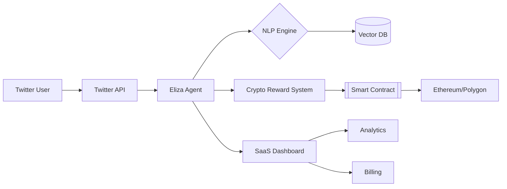

Here’s a structured roadmap with technical and functional details for your SaaS project. Copy this directly into your documentation:

---

# **Roadmap: AI-Powered Twitter Agent SaaS with Crypto Rewards**  
*Built on a16z’s Eliza OS*  

---

## **Phase 1: Foundation Setup (Weeks 1-4)**  
### **Objectives**: Core Eliza OS setup, Twitter integration, basic agent logic  
#### **Key Tasks**:  
1. **Eliza OS Installation**  
   ```bash
   git clone https://github.com/elizaOS/eliza.git
   pnpm install && pnpm build
   ```  
   - Configure `.env` with:  
     ```plaintext
     TWITTER_API_KEY=<your_key>
     OPENAI_API_KEY=<your_key>
     ETHEREUM_NODE_URL=<infura/alchemy_url>
     ```  

2. **Twitter Agent Core**  
   - Activate plugins in `character.json`:  
     ```json
     "plugins": ["@elizaos/plugin-twitter", "@elizaos/plugin-ethereum"]
     ```  
   - **How It Works**:  
     - Listens to Twitter mentions/DMs via `agent-twitter-client`  
     - Uses NLP (GPT-4) to classify intent (support, complaint, feedback)  
     - Stores interaction history in PostgreSQL  

3. **Basic SaaS Infrastructure**  
   - AWS EC2/Vercel deployment  
   - Multi-tenant architecture:  
     ```python
     # Pseudocode: Tenant isolation
     class Brand:
         def __init__(self, api_keys, reward_rules):
             self.agent = Eliza(plugins=brand_plugins)
             self.wallet = EthereumWallet(private_key)
     ```  

---

## **Phase 2: Core Features (Weeks 5-8)**  
### **Objectives**: Crypto rewards, analytics, multi-brand support  
#### **Key Components**:  
1. **Crypto Reward System**  
   - **Workflow**:  
     1. User interaction → Sentiment analysis (VaderNLP) → Engagement score  
     2. If score > threshold:  
        ```solidity
        // Smart contract: ERC-20 reward
        function rewardUser(address user, uint256 points) external {
            _mint(user, points * 1e18); // 1 point = 1 token
        }
        ```  
     3. Send ETH/tokens via MetaMask/Coinbase Wallet integration  

   - **Security**:  
     - AWS KMS for wallet private keys  
     - Rate limiting: Max 5 rewards/user/day  

2. **Analytics Dashboard**  
   - **Tech Stack**: React + D3.js + PostgreSQL  
   - **Metrics Tracked**:  
     - Engagement rate (replies/retweets)  
     - ETH rewards distributed  
     - Sentiment trends (positive/negative)  

3. **Multi-Brand Management**  
   - **Isolation Strategy**:  
     - Separate Eliza instances per brand  
     - Role-based access control (RBAC):  
       ```yaml
       # Example RBAC rules
       roles:
         - brand_admin: [configure_agent, view_analytics]
         - super_admin: [manage_billing, access_all_brands]
       ```  

---

## **Phase 3: Advanced Features (Weeks 9-12)**  
### **Objectives**: Scalability, compliance, automation  
#### **Key Features**:  
1. **Automated Campaigns**  
   - **Workflow**:  
     - Brands schedule tweets via admin dashboard  
     - Eliza auto-replies with context from RAG (brand docs + FAQs)  
     - Example RAG pipeline:  
       ```python
       from eliza.rag import VectorDB
       db = VectorDB("faq.pdf")
       context = db.query("How to reset password?")
       response = gpt4.generate(context + user_query)
       ```  

2. **Compliance Layer**  
   - **Components**:  
     - Twitter API policy checker (auto-delete banned hashtags)  
     - KYC via Coinbase API for rewards > 0.1 ETH  
     - GDPR-compliant data logging (user pseudonymization)  

3. **Scalability Upgrades**  
   - **Infrastructure**:  
     - AWS Lambda for serverless agent scaling  
     - Redis caching for frequent Twitter API queries  
   - **Blockchain**: Polygon L2 integration for low-cost transactions  

---

## **Phase 4: Monetization & Launch (Weeks 13-16)**  
### **Objectives**: Pricing tiers, marketing, support  
#### **Implementation**:  
1. **Pricing Model**  
   | Tier         | Features                          | Price/Month |  
   |--------------|-----------------------------------|-------------|  
   | **Starter**  | 1 agent, basic analytics          | $99         |  
   | **Pro**      | 5 agents, crypto rewards          | $299        |  
   | **Enterprise**| Custom plugins, SLA support       | Custom      |  

2. **Payment Integration**  
   - Stripe for fiat billing  
   - Coinbase Commerce for crypto payments  

3. **Launch Strategy**  
   - Closed beta with 10 brands  
   - Automated onboarding flow:  
     ```mermaid
     flowchart LR
         A[Sign Up] --> B[Connect Twitter]
         B --> C[Configure Agent]
         C --> D[Fund Wallet]
         D --> E[Go Live]
     ```  

---

## **Technical Architecture Overview**  


### **How It All Works**:  
1. **User Interaction**:  
   - Tweets/DMs → Eliza processes via NLP → Classifies intent → Generates response  

2. **Reward Trigger**:  
   - Engagement score ≥ 80 → Smart contract executes → ETH sent to user’s wallet  

3. **SaaS Backend**:  
   - Multi-tenant architecture isolates brand data  
   - Real-time analytics powered by PostgreSQL + Redis  

4. **Security**:  
   - Private keys stored in AWS KMS  
   - All Twitter API calls rate-limited (450 requests/15min)  

---

## **Post-Launch Roadmap**  
1. **Q1 2025**: Add Telegram/Discord plugin support  
2. **Q2 2025**: AI-generated content (images/videos) via Stable Diffusion  
3. **Q3 2025**: DAO governance for reward rule voting  

---

Copy this template and expand sections with your team’s specific implementation details. For visual mapping, use the Mermaid diagrams provided earlier.
